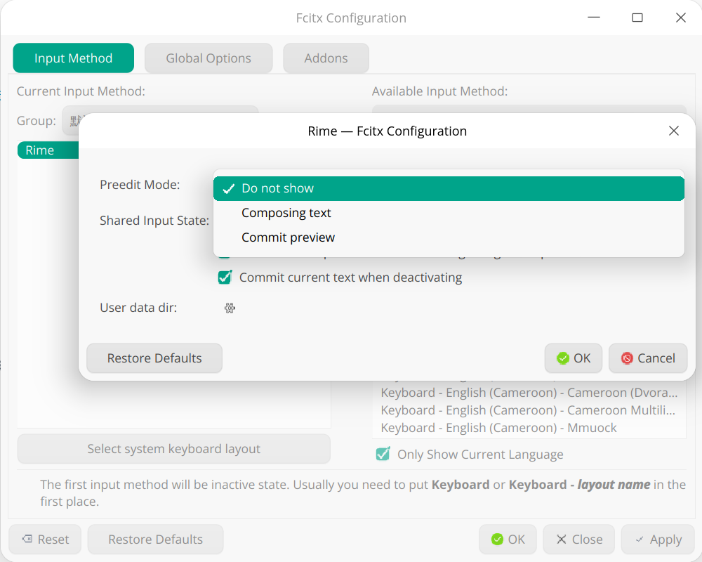

# Rime 定制

## 功能特性

- [rime-ice](https://github.com/iDvel/rime-ice)
- [小鹤双拼](https://flypy.cc/#/up)
- 只显示双拼编码
- 仿微信输入皮肤

## 如何使用？

### Windows

使用[小狼毫 Weasel](https://github.com/rime/weasel) 输入法，用户目录可通过右键直接打开。

- 手动安装 [rime-ice](https://github.com/iDvel/rime-ice) 到用户目录后
- 将该仓库中的 `/config` 文件夹下的所有文件直接粘贴到用户目录下，遇到同名文件直接覆盖即可

### Linux

经测试，最后选择了 [fcitx5-rime](https://github.com/fcitx/fcitx5-rime) 做为 Linux 下的 RIME 输入法。值得注意的是[该版本输入法 UI 由 Fcitx 控制](https://github.com/fcitx/fcitx5-rime/issues/119)。由于默认的主题实在是太复古了，现在暂时先使用 [fcitx5-nord](https://github.com/tonyfettes/fcitx5-nord) 主题，之后会尝试定制一个主题。

该输入法在 Linux 下默认配置文件夹为 [`~/.local/share/fcitx5/rime`](https://github.com/fcitx/fcitx5-rime/issues/61#issuecomment-1649779614)，安装方式同 Windows 下的操作。此外，如果碰到了以下情况：

- 按键预上屏但是光标不跟着移动（可能是缺陷？）
- 只想使用内联的输入方式

可通过[禁用 Preedit Mode 解决](https://github.com/fcitx/fcitx5-rime/issues/81)，方式如下：

## TODO

- 定制 fcitx5 主题
- 支持双拼编码 + 全拼编码显示
- 支持 Node.js 脚本一键初始化
